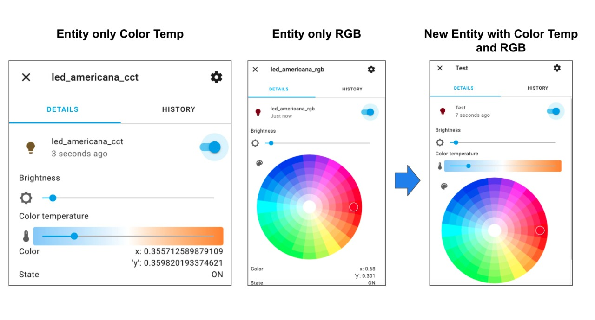

# Merge Light ColorTemp/RGB [[Home Assistant](https://www.home-assistant.io/) Component]
## join 2 light entities for the same device. useful for controlling unified devices that offer an entity for Color Temp and another RGB.



Merge Light ColorTemp / RGB is used to solve problems of some lighting devices that offers 2 different entities to control the lighting. Usually there is an entity to control the color temperature and another to control the RGB color.

This component creates a single entity where you will have the control of color temperature and RGB at the same time. Simplifying the use of the device.


## Basic Installation/Configuration Instructions:

#### Manual Installation:
All of the files in the merge_light_ct_rgb folder must be placed under config/custom_components/merge_light_ct_rgb/. If copying and pasting, make sure to use the Raw button or the links below:

```
config/custom_components/merge_light_ct_rgb/__init__.py
config/custom_components/merge_light_ct_rgb/light.py
config/custom_components/merge_light_ct_rgb/const.py
config/custom_components/merge_light_ct_rgb/manifest.json
```

#### Component Configuration:
```yaml
# Example configuration.yaml entry
merge_light_ct_rgb:
```

#### Light Configuration:
```yaml
# Example configuration.yaml entry
light:
  - platform: merge_light_ct_rgb
    name: "Led kitchen"
    entity_id_light_ct: light.led_cct
    entity_id_light_rgb: light.led_rgb
```
Light configuration variables:
* **name** (_Optional_): The name to use when displaying this switch.
* **entity_id_light_ct** (_Required_): string: Light entities which should be set in Color Temp.
* **entity_id_light_rgb** (_Required_): string: Light entities which should be set in RGB.

## Todo
- synchronize states when ct and rgb entity change
